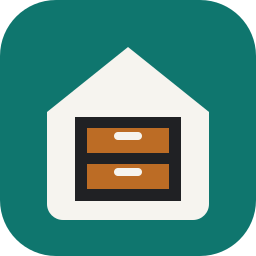
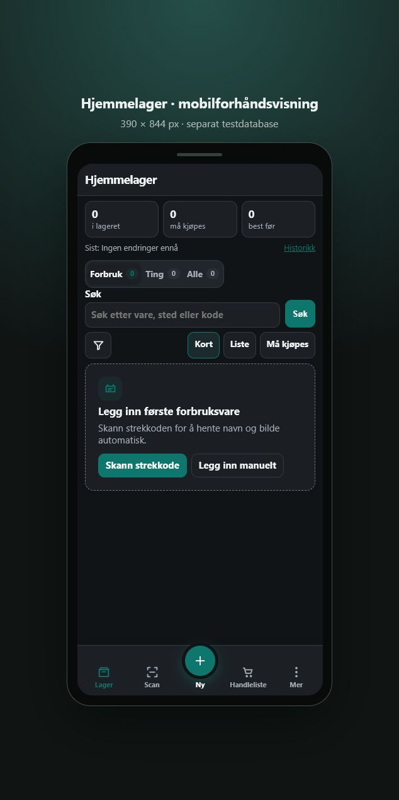

# Hjemmelager

En lokal og mobilvennlig lagerapp for Home Assistant. Hold orden på matvarer,
forbruksvarer, verktøy og andre gjenstander med strekkoder, bilder, NFC-tags,
handleliste, best før, historikk og backup.

## Høydepunkter

- Kort registrering med strekkodeoppslag eller manuell innskriving.
- Egen oversikt for forbruksvarer og gjenstander.
- Rask `+`/`−`, handleliste og angre etter lagerendring eller sletting.
- Bilder fra kamera eller bildebibliotek.
- Direkte NFC-kobling via Home Assistant-appen.
- Lokale data med komplett backup og lesbar CSV-eksport.

Se [ROADMAP.md](ROADMAP.md) for planen videre og
[hjemmelager/DOCS.md](hjemmelager/DOCS.md) for installasjon, bruk og oppdatering.
